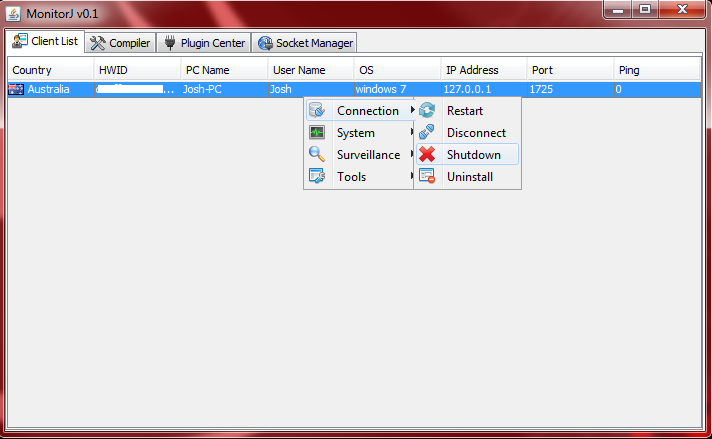

# MonitorJ-RAT
A Remote Administration Tool written in Java. Currently ready for public use, but many features aren't implemented yet.

### Requirements
* Base [pom.xml](./pom.xml)
* Server [pom.xml](./MonitorJ/pom.xml)
* Client [pom.xml](./MonitorJStub/pom.xml)
## This project was designed for educational purposes only and should only be used on devices you own.

### Features List:
* Multiple server listening
* Multiple client connections
* Client country tracking (Internet connection required)
* Stub Registry persistence
* Multi OS control
  - Windows
  - Mac OS(Not Tested)
  - Linux
* Client Stub Control:
  - Restart
  - Disconnect
  - Shutdown
  - Uninstall
* Client System Control:
  - Sleep
  - Log Off
  - Reboot
  - Shutdown
* Client Surveillance Control:
  - Remote Desktop
* Client Tools Control:
  - Remote Chat

Heres what it looks like so far:

This project is a work in progress, it was created for educational purposes only.

Feel free to browse through the source, let me know if I should fix something.
